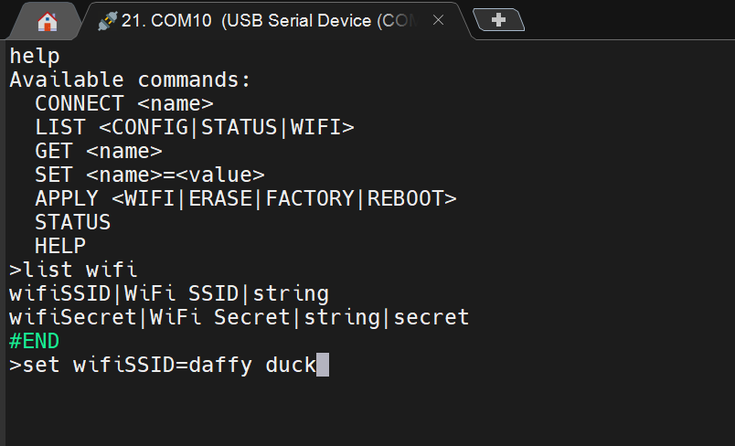
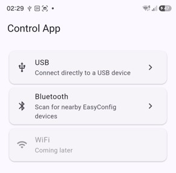
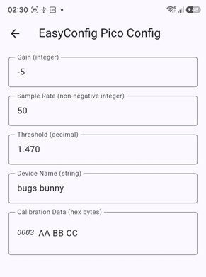

# AnyOperate Target for Pi Pico W

This project provides a demo Pi Pico W microcontroller project that implements a configuration system. The system allows the user to read and modify variables remotely (via USB, BLE or WiFi). The remote connection can be done using USB Serial (via any serial console software) or via WiFi (using Telnet), or via USB or BLE (and WiFi in the future) using the [AnyOperate Client Mobile App](https://github.com/shabaz123/AnyOperate) (available for Android currently).

# Using the Pre-built Firmware

A pre-built .uf2 binary is available in the build-pico-Release folder. Hold down the BOOT button on the Pi Pico W, then insert the USB cable to the PC, and then release the BOOT button. A drive letter should appear on the PC. Drag-and-drop the .uf2 file on the drive letter, and the Pi Pico W firmware should be uploaded within seconds, and the code will immediately begin execution.

## Using a PC
To try the app using a PC, open a serial terminal to the Serial COM port that should have appeared. Hit return to see a prompt.

## Using the AnyOperate Mobile App
If AnyOperate mentioned earlier is installed, then either connect a USB cable between your phone and the Pi Pico W and select USB transport within the AnyOperate app, or, select Bluetooth if you wish to connect via BLE.

On the next screens that will appear, you will be able to observe and modify configuration parameters within the demo Pi Pico firmware.

# Building the Code
You'll need your PC set up to with the Pi Pico RP2040 C/C++ SDK installed, and the ARM GNU Toolchain. Inspect (and most likely adjust) the build.ps1 file if you wish to build on Windows using PowerShell.

